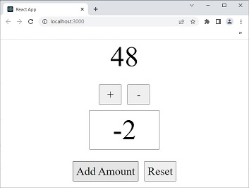

# An extract from [React Redux Quick Start](https://react-redux.js.org/tutorials/quick-start) for *idiot*

[](https://madmuseum.org/events/ghost-shell)

## Prologue 
How long can we live? A couple of decades, a couple of days, a couple of seconds... nobody knows... The only thing I know is **"Everything has a time"**. 
I have studied science and literature throughout my life. I have learned how to create things from scratch; how to works with my bare hands. But all I know will vanish as long as my physical portion expires. 

If one can persist memory in a *vault*, *store* or some other devices so that one's memory may outlive the body. By then, this meta-physical existence of *oneself* is still the same physical oneself or not... I doubt... I don't know... 


## I. Install Redux Toolkit and React Redux
First thing first, What is Redux?

> **Redux is a pattern and library for managing and updating application state, using events called "actions".** It serves as a centralized store for state that needs to be used across your entire application, with rules ensuring that the state can only be updated in a predictable fashion.

> Redux helps you manage "global" state - state that is needed across many parts of your application.

> It's a trade-off between short term and long term productivity.

[Redux](https://redux.js.org/) is the original *old school* state manager for react but now the creators of redux offer toolkit and on the redux website it says [redux toolkit](https://redux-toolkit.js.org/) is intended to be the standard way to write redux logic and we strongly recommended that you use it. So moving forward redux toolkit is the modern application of redux that you should learn how to implement. 

```bash
npm install @reduxjs/toolkit react-redux
```


## II. Create a Redux Store
app/store.js
```javascript
import { configureStore } from '@reduxjs/toolkit'

export default configureStore({
reducer: {},
})
```
> A store is a JavaScript object with a few special functions and abilities that make it different than a plain global object:

- You must never directly modify or change the state that is kept inside the Redux store

- Instead, the only way to cause an update to the state is to create a plain **action** object that describes "something that happened in the application", and then **dispatch** the action to the store to tell it what happened.

- When an action is dispatched, the store runs the root **reducer** function, and lets it calculate the new state based on the old state and the action

- Finally, the store notifies **subscribers** that the state has been updated so the UI can be updated with the new data.


## III. Provide the Redux Store to React
index.js
```javascript
import React from 'react';
import ReactDOM from 'react-dom/client';
import './index.css';
import App from './App';
import { store } from './app/store'
import { Provider } from 'react-redux'

const root = ReactDOM.createRoot(document.getElementById('root'));
root.render(
  <React.StrictMode>
    <Provider store={store}>
    <App />
    </Provider>  
  </React.StrictMode>
);
```


## IV. Create a Redux State Slice
Splitting up redux state object into multiple slices of state. So, a slice is really a collection of reducer logic of actions for a single feature in the app. 

For example, a blog might have a slice for post and another 
slice for comment to handle the logic of each differently. 
So they each get their own slice. 

> Creating a slice requires a string name to identify the slice, an initial state value, and one or more reducer functions to define how the state can be updated. Once a slice is created, we can export the generated Redux action creators and the reducer function for the whole slice.

features/counter/counterSlice.js
```javascript
import { createSlice } from '@reduxjs/toolkit'

const initialState = {
    count: 0
}
export const counterSlice = createSlice({
    name: 'counter',
    initialState, 
    reducers: {
        increment: (state) => {
            state.count++; 
        },
        decrement: (state) => {
            state.count--; 
        },
        reset: (state) => {
            state.count = 0 
        },
        incrementByAmount: (state, action) => {
            state.count += action.payload
        }
    }
})

export const { increment, decrement, reset, incrementByAmount } = counterSlice.actions 
export default counterSlice.reducer
```

The benefit here is that our component doesn't even have to know the structure of the state at all. All of that is now handled in the slice. 


## V. Add Slice Reducers to the Store
> By defining a field inside the reducers parameter, we tell the store to use this slice reducer function to handle all updates to that state.

app/store.js
```javascript
import counterReducer from '../features/counter/counterSlice'

export const store = configureStore({
    reducer: {
        counter: counterReducer
    }

})
```


## VI. Use Redux State and Actions in React Components
> Read data from the store with useSelector, and dispatch actions using useDispatch. 

features/counter/Counter.js
```javascript
import { useSelector, useDispatch } from "react-redux"
import { increment, decrement, 
         reset, incrementByAmount } from './counterSlice'
import { useState } from "react"

const Counter = () => {
    const count = useSelector(state => state.counter.count)
    const dispatch = useDispatch()
    
    const [ incrementAmount, setIncrementAmount ] = useState(0)
    const addValue = Number(incrementAmount) || 0
    
    const resetAll = ()=> {
        setIncrementAmount(0)
        dispatch(reset())
    }

  return (
    <section>
        <p>{count}</p>
        <div>
            <button onClick={() => dispatch(increment())}>+</button>
            <button onClick={() => dispatch(decrement())}>-</button>
        </div>
        <input type='text' 
               value={incrementAmount} 
               onChange={ e=> setIncrementAmount(e.target.value)}
               />

        <div>
            <button onClick={ ()=> dispatch(incrementByAmount(addValue)) }>
                Add Amount
            </button>
            <button onClick={ resetAll }>
                Reset
            </button>
        </div>
    </section>
  )
}

export default Counter
```


## VII. Output screen 


## Epilogue 
Redux is not an answer; Redux a question. It opens a way to let you re-think how to manage and share application state. Each store has many features ([Separation of concerns](https://en.wikipedia.org/wiki/Separation_of_concerns)), each feature is represented as slice (name, state and action), each slice exports actions (to be used by compoents) and reducer (to be used by store). Retrieving state from store and invoking action to *change* the store is only slightly different. 

If you use [useContext](https://blog.webdevsimplified.com/2020-06/use-context/) then switching to Redux seems a better choice before your project grows larger and harder to manage.  


## VIII. Reference 
1. [React Redux Full Course for Beginners | Redux Toolkit Complete Tutorial](https://youtu.be/NqzdVN2tyvQ)
2. [Redux in 100 Seconds](https://youtu.be/_shA5Xwe8_4)
3. [React Redux Quick Start](https://react-redux.js.org/tutorials/quick-start)
4. [Redux Fundamentals, Part 1: Redux Overview](https://redux.js.org/tutorials/fundamentals/part-1-overview)
5. [Redux Fundamentals, Part 2: Concepts and Data Flow](https://redux.js.org/tutorials/fundamentals/part-2-concepts-data-flow)
6. [Redux Fundamentals, Part 3: State, Actions, and Reducers](https://redux.js.org/tutorials/fundamentals/part-3-state-actions-reducers)
7. [Redux Fundamentals](https://redux.js.org/tutorials/fundamentals/part-1-overview)


## EOF (2022/12/30)